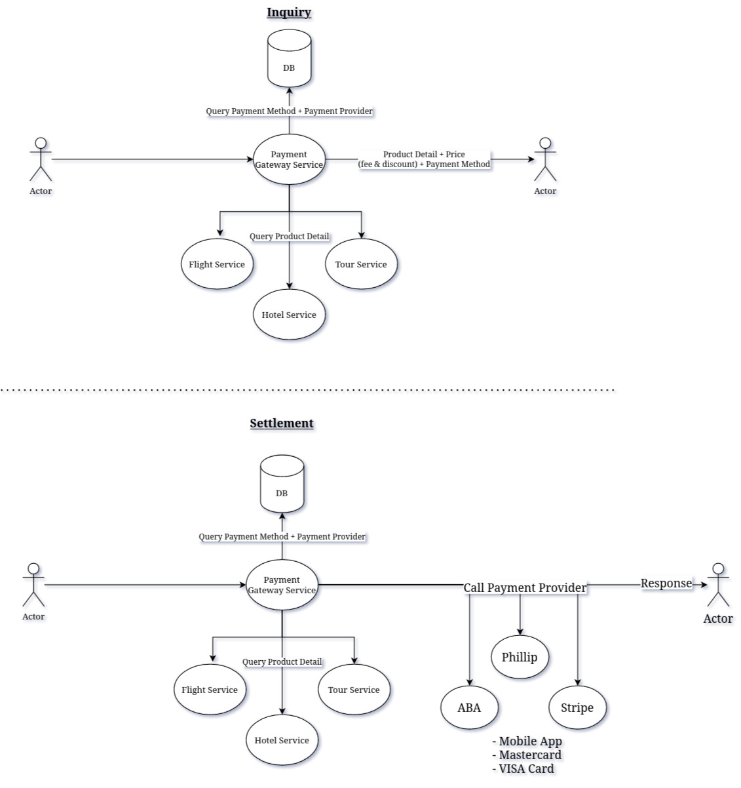

# Problem statement
Design a Payment Gateway Service that support multiple products, payment methods, payment provider and additional operation such as discount and additional fee charge by the payment method.

## Operation
There are two main operation: inquiry and settlement.

### Inquiry
Inquiry operation start when the actor is calling to Payment Gateway Service to inquiry product price. Upon receive the request, Payment Gateway Service may request to other services such as Tour/Flight/Hotel. The request destination is determined by the Product Type that the actor is given. After that, Payment Gateway Service will query database for some information related to Payment Method and its provider. Afterward, Payment Gateway Service will calculate discount, fee and prepare data before response to the Actor.

### Settlement
Similar to the Inquiry process, Payment Gateway Service will start from product detail inquiry, query for specific Payment Provider, Calculate total cost and make a request call to the Payment Provider. 

# FAQ
## Setter for entity?
In Hexagonal Architecture, the primary focus is on keeping the domain entities and business logic separate from the infrastructure and presentation layers. The entities in the domain should be treated as immutable objects, meaning they should not be modified after they are created.

Therefore, it is generally not recommended to allow changing the ID of an entity by generating a setter in Java. Instead, you should create a new entity with the updated ID if needed. This helps to ensure that the domain entities remain in a consistent state and that any changes to the entities are tracked and auditable.

## Why Manually Generate Constructor
Because it's much easier to add business logic and validation there.

# Diagram 

